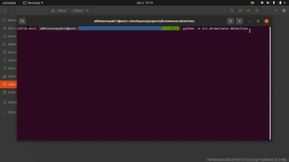

# Drowsiness Detection

## Table of Content
  * [Overview](#overview)
  * [Application](#application)
  * [Approach](#approach)
  * [Installation](#installation)

## [Overview](#table-of-content)
This project will detect a drowsy person through live webcam, alert them while displaying that person's face. 

**
App demo
**

## [Application](#table-of-content)
- Monitor drivers to avoid accidents
- Monitor students in class to sport the inattentive one (although, that would be mean :p)

## [Approach](#table-of-content)
1. Using dlib face detector, detect all the faces from live video.
2. Using dlib landmarks preditor, locate 68 landmarks on each face.
3. Calculate the average eye aspect ratio (EAR) for the eyes. 
4. Extract the face which has EAR < 0.22 (value got after trial and error) for more than 10 frames, display it while giving an alert sound

## [Installation](#table-of-content)
- You need Python (3.6) & git (to clone this repo)
- `conda env create -f environment.yml` : Create a virtual env with all the dependencies
- `git clone git@github.com:abhinavnayak11/Drowsiness-Detection.git .` : Clone this repo
- `cd path/to/project` : cd into the project folder
- `conda activate dlib-env` : activate the virtual env
- `python -m src.drowsiness-detection` : Run the script

 

### Inspiration
- Akshay Bahadur, [Drowsiness Detection repo](https://github.com/akshaybahadur21/Drowsiness_Detection)

---

